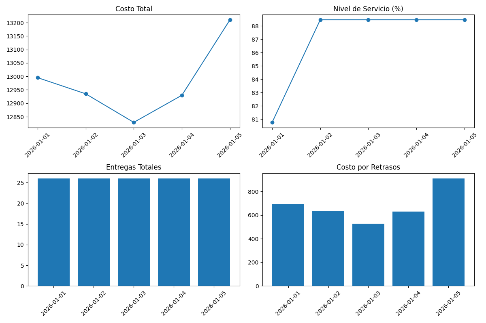
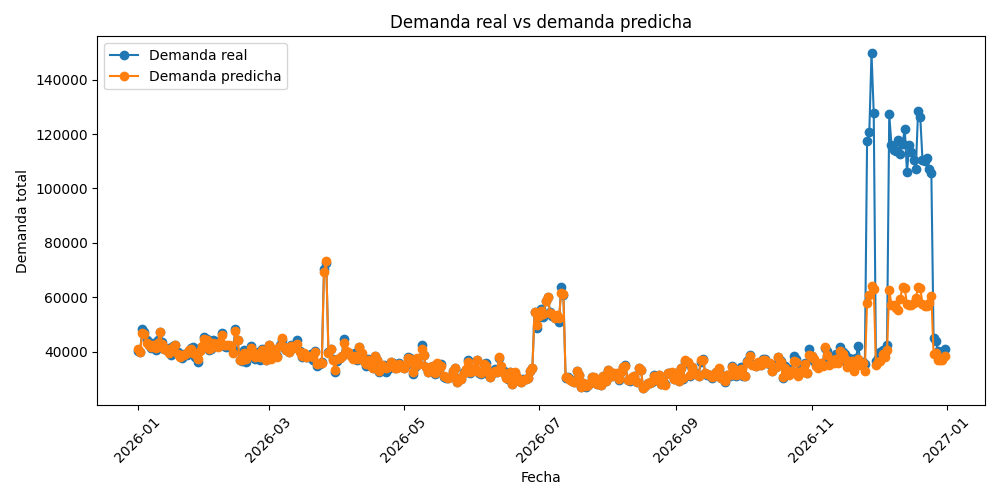

# Red Logística Inteligente

## Sistema Logístico Inteligente Impulsado por Inteligencia Artificial

Proyecto Final – Inteligencia Artificial


---

## Descripción General

Este proyecto simula una red logística inteligente inspirada en sistemas modernos de supply chain como Amazon Logistics.

El sistema integra:

- Predicción de demanda con Machine Learning
- Asignación inteligente de almacenes
- Gestión de capacidad de camiones
- Rutas multi-destino
- Simulación de tráfico y congestión
- Estimación de costos logísticos
- Evaluación de nivel de servicio

El objetivo es predecir la demanda de productos y generar operaciones logísticas automáticas utilizando toma de decisiones basada en Inteligencia Artificial.

---

## Funcionalidades Principales

### 1. Predicción de Demanda con Machine Learning

El proyecto utiliza un modelo Random Forest Regressor para pronosticar la demanda.

El modelo considera variables como:

- Zona de la tienda
- Demanda histórica
- Eventos y efectos estacionales
- Riesgo de sobrecarga
- Variables de fecha

Métricas de evaluación utilizadas:

- **MAE:** mide el error promedio entre la demanda real y la predicha.
- **RMSE:** penaliza más los errores grandes de predicción.
- **MAPE:** mide el porcentaje promedio de error de predicción.

---

### 2. Asignación Inteligente de Logística

El motor logístico permite:

- Asignar tiendas a almacenes disponibles
- Validar disponibilidad de rutas
- Asignar entregas a camiones
- Respetar restricciones de capacidad
- Calcular costos de transporte
- Evaluar desempeño operativo

---

### 3. Rutas Multi-Destino para Camiones

El sistema de rutas evolucionó de un esquema simple:

```text
almacén -> tienda -> almacén
```

A un esquema multi-destino:

```text
almacén -> tienda 1 -> tienda 2 -> tienda 3 -> almacén
```

Esto permite:

- Consolidación de rutas
- Reducción de viajes redundantes
- Mejor utilización de camiones
- Simulación logística más realista

La implementación actual utiliza una heurística de construcción de rutas. No representa todavía una optimización matemática exacta tipo VRP con OR-Tools, pero mejora significativamente el comportamiento logístico frente al modelo inicial.

### 4. Simulación de Tráfico y Riesgo
El proyecto simula:
- Congestión vehicular
- Retrasos de entrega
- Riesgo de tráfico
- Probabilidad de sobrecarga

Esto crea un entorno logístico más realista para evaluar decisiones operativas.

## Arquitectura del Sistema

El sistema sigue un flujo de procesamiento completo:

```text
Generador de Demanda
        ↓
Predicción con Machine Learning
        ↓
Generación de Pedidos
        ↓
Asignación de Almacenes
        ↓
Asignación de Camiones
        ↓
Rutas Multi-Destino
        ↓
Simulación de Entregas
        ↓
Evaluación de Costos y Nivel de Servicio
```

## Estructura del Proyecto

```text
Red-Logistica-Inteligente/
├── app/
│   ├── main.py
│   ├── logistics.py
│   ├── logistics_engine.py
│   ├── routing.py
│   ├── order_adapter.py
│   ├── delivery_simulation.py
│   ├── demand_forecast_model.py
│   ├── products.py
│   ├── visualizations.py
│   └── reporting.py
│
├── src/
│   └── simulation/
│       ├── demand_generator.py
│       ├── logistics_network.py
│       └── simulation_engine.py
│
├── data/
│   └── raw/
│       ├── demand_data.csv
│       ├── warehouses.csv
│       ├── trucks.csv
│       ├── routes.csv
│       ├── demand_heatmap.png
│       ├── demand_over_time.png
│       ├── event_spikes.png
│       ├── overload_risk.png
│       ├── route_distances.png
│       ├── traffic_risk.png
│       ├── trucks_distribution.png
│       ├── warehouses_capacity.png
│       └── zone_comparison.png
│
├── outputs/
│   ├── demand_forecast_results.csv
│   ├── demand_model_metrics.csv
│   ├── executive_summary.csv
│   ├── forecast_vs_real.png
│   ├── predicted_demand_by_zone.png
│   └── logistics_kpi_dashboard.png
│
├── README.md
├── requirements.txt
├── Dockerfile
├── docker-compose.yml
├── .dockerignore
└── .gitignore
```

### Módulos de Extensión Futura

Algunos archivos están incluidos como base para futuras mejoras del sistema, aunque no forman parte del pipeline principal ejecutado actualmente por Docker.

- `app/products.py`: define un catálogo inicial de productos y categorías. Está pensado para futuras integraciones con inventarios reales, tiendas o bases de datos de productos.
- `src/simulation/simulation_engine.py`: contiene una simulación logística base que puede usarse como referencia operativa para comparar escenarios o extender el modelo en versiones posteriores.

En la versión actual, el sistema trabaja principalmente con datos simulados de tiendas, zonas, demanda, almacenes, rutas y camiones.

### Instalación

Clonar el repositorio:

```bash
git clone https://github.com/vpinedab/Red-Logistica-Inteligente.git
cd Red-Logistica-Inteligente
```

El proyecto usa Docker para construir el entorno de ejecución e instalar automáticamente las dependencias definidas en `requirements.txt`.

### Cómo Ejecutar el Proyecto

Desde la carpeta principal del repositorio, ejecutar:

```bash
docker compose up --build
```

Este comando construye la imagen de Docker y ejecuta el pipeline completo de la simulación logística inteligente.

### Pipeline Ejecutado

Docker ejecuta automáticamente los siguientes pasos:

**Paso 1: Generar Simulación de Demanda**

```bash
python3 src/simulation/demand_generator.py
```

**Paso 2: Generar Red Logística**

```bash
python3 src/simulation/logistics_network.py
```

**Paso 3: Ejecutar Pipeline Completo**

```bash
python3 -m app.main
```

### Resultados Generados
El sistema genera:
- Pronósticos de demanda
- Métricas de evaluación del modelo
- Asignación de pedidos a almacenes
- Asignación de pedidos a camiones
- Costos logísticos
- Métricas de entrega
- Nivel de servicio
- Visualizaciones de red logística

Ejemplo de salida:
Pedidos asignados a almacenes: 26
Pedidos no asignados: 0
Nivel de servicio: 88.46%

### Visualizaciones

El proyecto genera automáticamente visualizaciones para:

- Capacidad de almacenes
- Distribución de carga de camiones
- Distancias de rutas
- Distribución de riesgo de tráfico
- Predicción de demanda por zona
- Comparación entre demanda real y demanda predicha
- Dashboard de KPIs logísticos

Las visualizaciones se guardan en dos carpetas:

- `data/raw/`: visualizaciones generadas durante la simulación de demanda y red logística.
- `outputs/`: visualizaciones finales del modelo predictivo y del dashboard logístico.

## KPIs del Sistema

| KPI | Resultado |
|---|---|
| Pedidos asignados | 26 |
| Pedidos sin asignar | 0 |
| Nivel de servicio | 88.46% |
| Modelo ML | Random Forest Regressor |
| Error MAPE | 20% |

### Tecnologías Utilizadas
- Python
- Pandas
- NumPy
- Scikit-learn
- Matplotlib

### Contribuciones Principales
Las principales contribuciones del sistema incluyen:
- Integración de forecasting con IA
- Implementación de Random Forest para predicción de demanda
- Métricas de evaluación MAE, RMSE y MAPE
- Integración de demanda predicha al pipeline logístico
- Mejora del sistema de rutas para camiones
- Implementación de rutas multi-destino
- Corrección de consistencia entre demanda y rutas
- Evaluación de costos y nivel de servicio

### Salidas generadas

El sistema genera archivos en dos carpetas principales:

**`data/raw/`**

- demand_data.csv
- routes.csv
- trucks.csv
- warehouses.csv
- demand_heatmap.png
- demand_over_time.png
- event_spikes.png
- overload_risk.png
- route_distances.png
- traffic_risk.png
- trucks_distribution.png
- warehouses_capacity.png
- zone_comparison.png

**`outputs/`**

- demand_forecast_results.csv
- demand_model_metrics.csv
- executive_summary.csv
- forecast_vs_real.png
- predicted_demand_by_zone.png
- logistics_kpi_dashboard.png

## Demand Forecast vs Real Demand
https://github.com/vpinedab/Red-Logistica-Inteligente/blob/main/outputs/forecast_vs_real.png?raw=true

### Logistics KPI Dashboard
https://github.com/vpinedab/Red-Logistica-Inteligente/blob/main/outputs/logistics_kpi_dashboard.png?raw=true

### Dashboard KPI



### Forecast vs Real Demand



### Limitaciones Actuales

- El sistema utiliza datos simulados
- Las rutas utilizan heurísticas y no optimización exacta VRP
- No existe integración con APIs de mapas reales
- El tráfico es probabilístico y no tiempo real

### Trabajo Futuro

- Integración con Google Maps API
- Optimización VRP con OR-Tools
- Dashboard web interactivo
- Integración con datos reales
- Deep Learning para forecasting avanzado
- Integración con catálogos reales de productos e inventario
- Conexión de la simulación base con escenarios operativos más avanzados


### Conclusión
Este proyecto demuestra cómo la Inteligencia Artificial y la simulación logística pueden combinarse para crear un sistema inteligente de supply chain capaz de:
- Pronosticar demanda
- Asignar recursos logísticos
- Simular operaciones de transporte
- Evaluar desempeño de servicio
- Reducir ineficiencias operativas
- El resultado final es un pipeline completo de simulación logística impulsado por IA.

### Autores

- Valentina Pineda Barrón  
- Nuria García Valdecasas
- Natalia Quintana Guzmán
